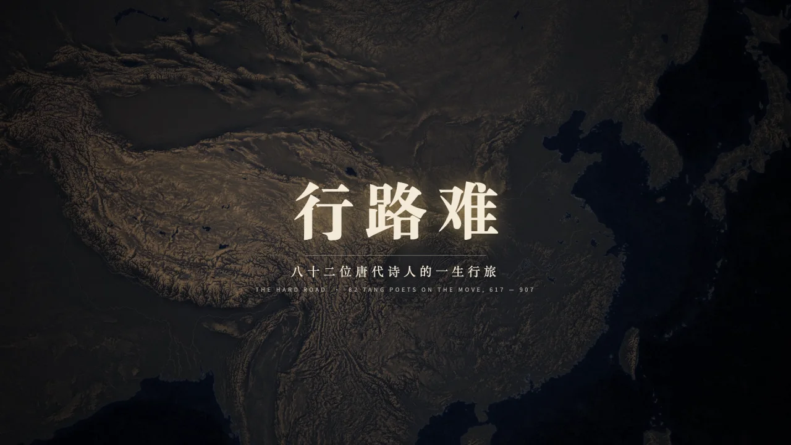
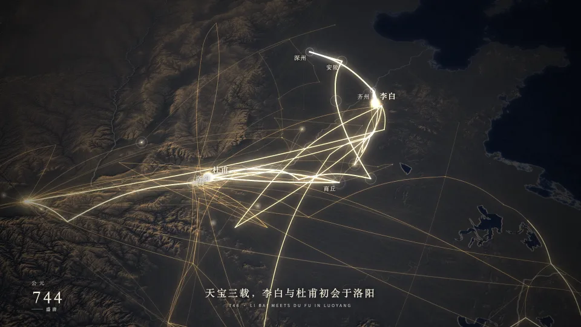
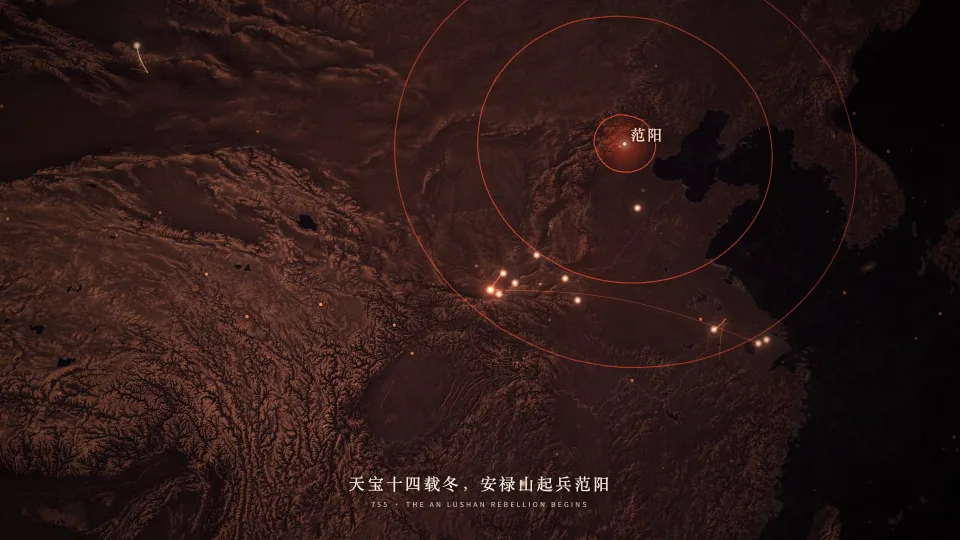
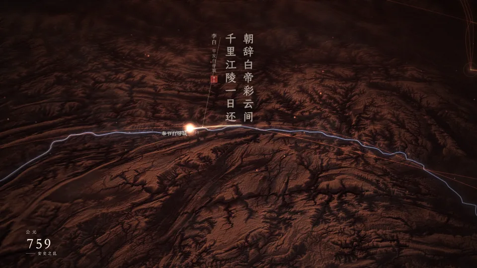
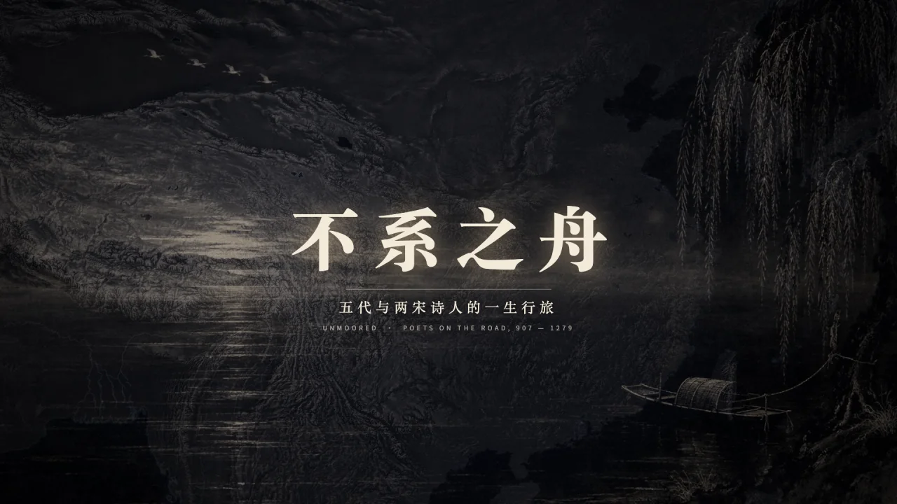
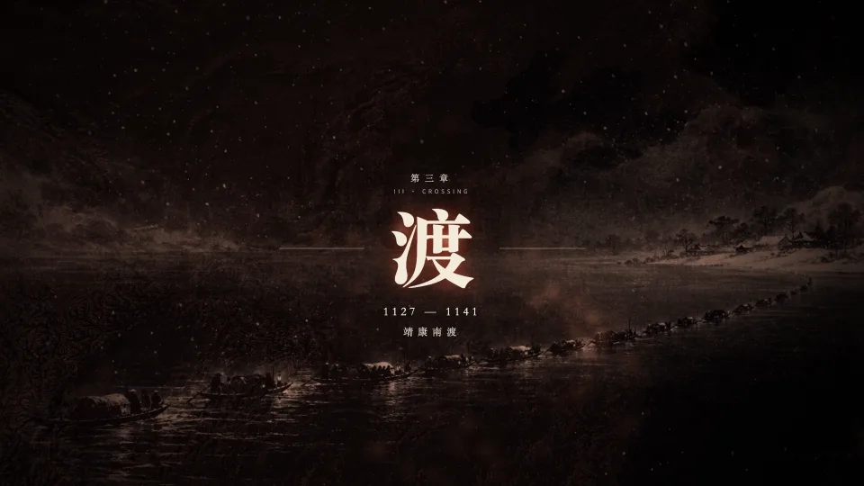
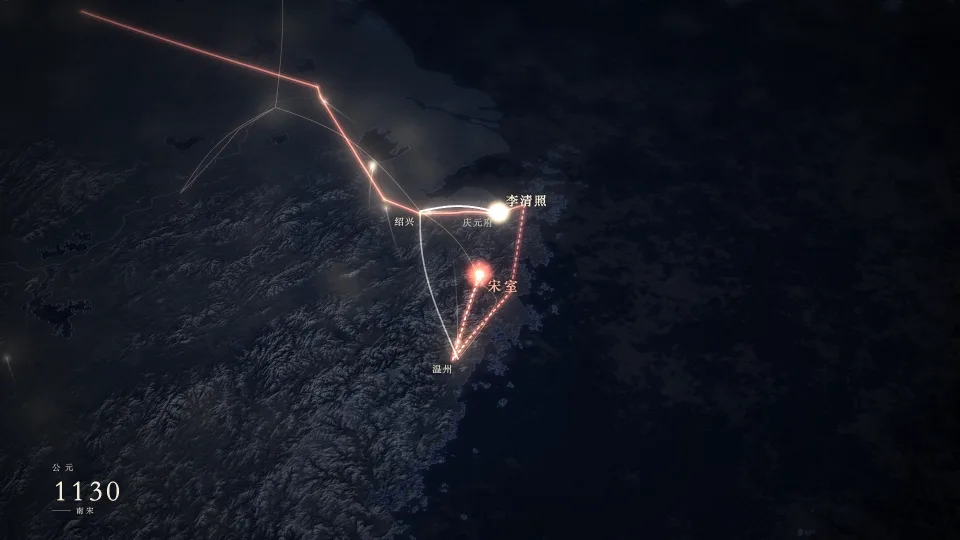
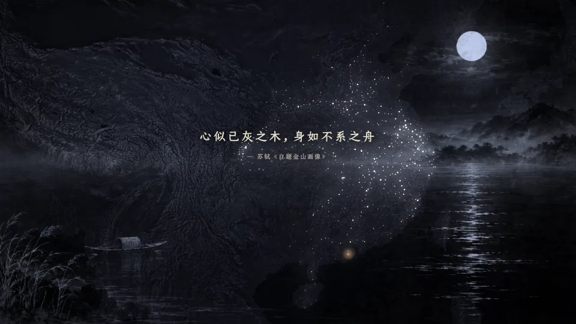

# 唐宋诗人行旅 · 两部短片

**Tang & Song Poets on the Road — two films**

两部横屏数据短片。素材是搜韵网《唐宋文学编年地图》里诗人们有年份的停留记录。片中把这些行迹放回三维地形上，讲两个朝代里诗人的聚散、迁徙和命运。

Two landscape films built from the dated itineraries in Souyun's chronological map of Tang–Song literature. The poets' recorded journeys are drawn back onto 3D terrain to tell how two dynasties gathered, scattered and moved their poets.

| | 行路难 · The Hard Road | 不系之舟 · Unmoored |
|---|---|---|
| 时代 Era | 唐 Tang, 617–907 | 五代至宋亡 Five Dynasties – Song, 907–1279 |
| 人物 Poets | 82 | 280 |
| 时长 Length | 4:00 | 5:34 |
| 母版 Master | 1920 × 1080 · 60 fps · H.264 · AAC | 1920 × 1080 · 60 fps · H.264 · AAC |
| 下载 Download | [Releases](../../releases) | [Releases](../../releases) |

---

## 行路难 · The Hard Road（617–907）

八十二位唐代诗人的一生行旅。五章：**聚**（长安）· **远**（西至龟兹、北抵漠北、南达驩州）· **散**（安史之乱后足迹南移）· **谪**（贬谪与流放）· **暮**（唐亡，灯火俱熄）。名句落在写下它的地方。

Eighty-two Tang poets' journeys in five chapters: gathering at Chang'an, reaching the frontiers, scattering south after the An Lushan rebellion, exile, and dusk. Famous lines appear where they were written.

| 744 李杜初会于洛阳 | 755 安禄山起兵范阳 | 759 千里江陵一日还 |
|---|---|---|
|  |  |  |

## 不系之舟 · Unmoored（907–1279）

从唐亡到崖山，二百八十位五代与两宋诗人。每位在世的诗人是地上的一点灯火，正在路上的行程是一颗彗星，特写时只点亮人物正在走的那一段。五章：

- **裂**：五代十国；
- **繁**：北宋一百五十年；
- **渡**：1127 年金兵破汴京，宋室一路南逃至临安，李清照追随流亡的朝廷由海道辗转浙东；
- **望**：百年隔淮相望；
- **沉**：临安陷落，文天祥过零丁洋，崖山。

片尾是苏轼的“心似已灰之木，身如不系之舟”。

From the fall of the Tang to the battle of Yashan: 280 poets of the Five Dynasties and the Song. Each living poet is a light on the land, and each journey under way is a comet. In close-ups, only the leg a poet is travelling now is lit. The five chapters:

- **Fracture**: the Five Dynasties and Ten Kingdoms.
- **Splendour**: the Northern Song.
- **Crossing**: Kaifeng falls in 1127 and the court flees south to Lin'an, with Li Qingzhao following it by sea.
- **Gazing north**: a century across the Huai.
- **Sinking**: Lin'an falls, Wen Tianxiang crosses the Lingding sea, and the Song ends at Yashan.

| 第三章 · 渡 | 1130 宋室浮海，李清照追随 | 尾声 · 不系之舟 |
|---|---|---|
|  |  |  |

## 方法 · Method

- **行迹 Itineraries**:
  - 只用有年份的停留记录。年内先后按月份或季节词，没有就按记录顺序（仅用于显示）。
  - 光轨只连接同一诗人相邻的两条记录，不插值、不补路。
  - Only dated stops are used; within a year they are ordered by month or season words, or by record order (display only). Trails connect consecutive records of the same poet only; no interpolation.
- **地形 Terrain**:
  - AWS Terrain Tiles（terrarium）与 Natural Earth 河湖，球面 Albers 等积投影。
  - 宽幅底图层保证全景无黑边。
  - 不画任何现代国界或省界。
  - AWS Terrain Tiles and Natural Earth rivers and lakes, spherical Albers equal-area projection. A wide base layer keeps wide shots free of black edges, and no modern boundaries are drawn.
- **史实叠层 Historical overlays**（不系之舟）：金兵两路进军、二帝北去、宋室南迁路线、1141 年宋金分界均为示意，据通行史籍标注，不属于数据集。 The Jin campaign, the captive emperors, the court's flight and the 1141 border are schematic and based on standard historical accounts; they are not part of the dataset.
- **水墨插画 Ink paintings**（不系之舟）：标题、各章节卡与片尾的水墨画由 AI 生成（Codex 图像生成）。合成时只取画面亮度，并按每章调色。 The ink paintings (title, chapter cards, ending) are AI-generated with Codex image generation, then composited by luminance and tinted per chapter.
- **渲染 Rendering**：three.js 位移地形 + Canvas 2D 光层，GPU 无头 Chrome 逐帧渲染，每一帧只由片内时间决定。 three.js displaced terrain plus a Canvas 2D light layer, rendered frame by frame in GPU headless Chrome; every frame is a pure function of film time.
- **配乐 Score**：原创，用 numpy 合成（古琴、筝、琵琶、箫、弓弦、鼓、锣、编钟、风、水），不含任何采样；与画面共用同一条时间线。 Original score synthesized in numpy, with no samples, driven by the same timeline as the picture.

## 署名 · Credits

- 制作 Made by：**@一尺之棰 · zeno.yczc**
- 数据 Data：搜韵网 · 唐宋文学编年地图（Souyun, chronological map of Tang–Song literature）
- 地形 Terrain：AWS Terrain Tiles · Natural Earth
- 配乐 Score：原创合成 Original synthesis

## 使用 · Use

个人作品，仅供非商业用途。转载请注明出处。数据版权归原网站所有。

Personal, non-commercial work. Please credit when sharing. Data rights remain with the original site.
